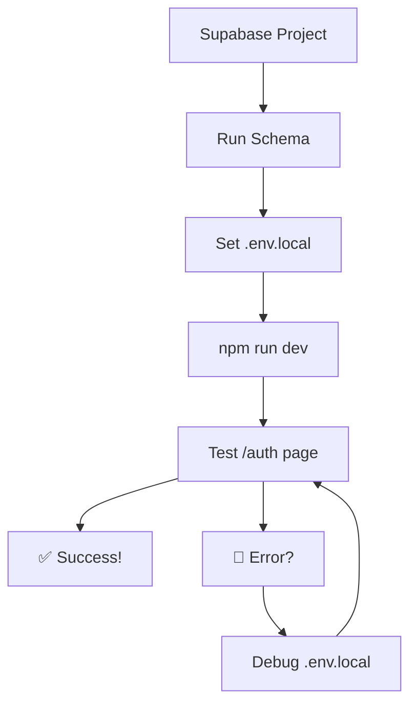

# 🎯 Immediate Next Action: Set Up Supabase & Test Integration

**Status:** Ready to implement  
**Estimated Time:** 30-45 minutes  
**Priority:** 🔴 **CRITICAL** — Blocks all backend-dependent features

---

## Why This First?

You have all the code scaffolding in place (env config, schema, types, hooks), but the **backend isn't connected yet**. This is the critical blocker for:
- ✅ Authentication (Auth page)
- ✅ Admin dashboard
- ✅ E-commerce checkout
- ✅ Live deployment

---

## Step-by-Step Implementation (30-45 minutes)

### **1. Create Supabase Project** (5 min)

1. Go to [https://supabase.com](https://supabase.com)
2. Click **New Project**
3. Fill in:
   - **Project name:** `ditechai`
   - **Database password:** Generate strong password (save this!)
   - **Region:** Closest to your users (e.g., US-East, EU-West)
4. Wait 2-3 minutes for provisioning
5. In project dashboard, go to **Settings → API**
6. Copy and save these values:
   ```
   Project URL:           https://your-project.supabase.co
   Anon (public) Key:     eyJhbGc... (starts with eyJ)
   Service Role Key:      (save for backend, not needed now)
   ```

**Save these values — you'll need them in Step 3.**

---

### **2. Run Database Schema** (10 min)

1. In Supabase Dashboard, go to **SQL Editor** (left sidebar)
2. Click **New Query**
3. Open your local repo and copy entire contents of:
   ```
   src/integrations/supabase/schema.sql
   ```
4. Paste into the SQL Editor
5. Click **Run** (blue button, top-right)
6. **Wait for completion** — you should see green checkmarks ✅

**Verify success:**
- Go to **Table Editor** (left sidebar)
- You should see these tables:
  - `customers`
  - `products`
  - `categories`
  - `orders`
  - `order_items`
  - `shipping_addresses`
  - `payment_intents`
  - `inventory_events`
  - `audit_logs`

If any tables are missing, check the SQL Editor output for errors.

---

### **3. Create `.env.local` for Testing** (2 min)

**In your repo root directory, create a new file `.env.local`:**

```bash
# Copy from template
cp .env.example .env.local
```

**Edit `.env.local` and fill in your Supabase credentials:**

```env
# Supabase Configuration (from Step 1)
VITE_SUPABASE_URL=https://your-project.supabase.co
VITE_SUPABASE_PUBLISHABLE_KEY=eyJhbGc...paste-your-anon-key

# API Endpoints Configuration
VITE_API_URL=http://localhost:8080
VITE_API_ENV=development

# Feature Flags
VITE_ENABLE_SHOP=true
VITE_ENABLE_ADMIN=true
VITE_ENABLE_CHECKOUT=true
```

**⚠️ Important:**
- Never commit `.env.local` to Git
- `.env.local` is in `.gitignore` by default
- This file is only for local development

---

### **4. Test Locally** (15 min)

**Terminal:**

```bash
# Install dependencies (if not already done)
npm install

# Start dev server
npm run dev
```

**Expected output:**
```
  VITE v5.4.19  ready in 1234 ms

  ➜  Local:   http://localhost:8080/
  ➜  press h to show help
```

**In your browser:**

1. Open [http://localhost:8080](http://localhost:8080)
2. The home page should load
3. **Open DevTools** (F12 or right-click → Inspect)
4. Go to **Console** tab
5. Look for this message:
   ```
   [Environment] Configuration loaded: {
     api: { baseUrl: 'http://localhost:8080', environment: 'development', ... },
     features: { enableShop: true, enableAdmin: true, enableCheckout: true }
   }
   ```

✅ **If you see this, environment config is working!**

**Check for errors:**
- You should **NOT** see any red errors about missing env vars
- If you see errors, verify `.env.local` is in the root directory and has correct keys

---

### **5. Verify Auth & Admin Pages Work** (10 min)

**Test Auth Page:**

1. Navigate to [http://localhost:8080/auth](http://localhost:8080/auth)
2. You should see a **Sign Up** form with:
   - Email input
   - Password input
   - "Sign Up" button
3. Try signing up with a test email:
   ```
   Email:    test@example.com
   Password: TestPassword123!
   ```
4. Click "Sign Up"

**Expected behaviors:**

| Result | Status |
|--------|--------|
| Form submits without error | ✅ Good |
| Redirects to Admin page after signup | ✅ Great |
| See "Supabase auth error" | 🔴 Check .env.local |
| See 404 on Auth page | 🔴 Check routing in App.tsx |

**Test Admin Page:**

1. Navigate to [http://localhost:8080/admin](http://localhost:8080/admin)
2. You should see a **login form** (if not authenticated) or **admin dashboard** (if logged in)
3. If you signed up in Step 5, try logging in with the same credentials

**Expected dashboard sections:**
- 📊 Dashboard (overview)
- 📝 Blog Posts
- 👥 Users
- 💬 Messages
- 📄 Files

---

## 📋 Why This Order?



---

## 🔴 Risks If You Skip This

| Skip | Consequence | Impact |
|------|-------------|--------|
| Skip Supabase setup | Auth/Admin pages fail silently | 🔴 High |
| Skip schema.sql | Orders table doesn't exist → checkout breaks | 🔴 High |
| Skip .env.local | App won't connect to backend | 🔴 Critical |
| Skip local test | Discover issues after cPanel upload (slower) | 🟡 Medium |

---

## ⏱️ Estimated Timeline

| Task | Time | Risk | Difficulty |
|------|------|------|------------|
| Supabase account + project creation | 5 min | Low | ⭐ |
| Run schema.sql | 10 min | 🟡 Medium | ⭐⭐ |
| Set .env.local | 2 min | Low | ⭐ |
| `npm install && npm run dev` | 5 min | Low | ⭐ |
| Test /auth page | 10 min | Low | ⭐ |
| **Total** | **32 min** | **🟡 Medium** | **⭐⭐** |

---

## 🚨 Troubleshooting

### Problem: Schema.sql Fails

**Error message:** `Extension "uuid-ossp" does not exist`

**Solution:** Already handled in schema — just run again. If persists:
```sql
-- Run this first in a new query:
CREATE EXTENSION IF NOT EXISTS "uuid-ossp";
-- Then run the full schema
```

**Error message:** `Relation "products" already exists`

**Solution:** Tables exist from previous run. Either:
- Drop tables first: `DROP TABLE IF EXISTS products CASCADE;`
- Or edit schema to add `IF NOT EXISTS` to each CREATE TABLE

---

### Problem: npm run dev fails

**Error:** `VITE_SUPABASE_URL is not defined`

**Solution:**
- Verify `.env.local` exists in root directory
- Check file has exactly these lines (with your real values):
  ```
  VITE_SUPABASE_URL=https://...
  VITE_SUPABASE_PUBLISHABLE_KEY=eyJ...
  ```
- Restart dev server: `CTRL+C` then `npm run dev`

---

### Problem: Auth page shows blank form

**Possible cause:** Supabase connection issue

**Debug steps:**
```typescript
// In browser console, test connection:
import { supabase } from '@/integrations/supabase/client'

// Try signing up
supabase.auth.signUp({
  email: 'test@example.com',
  password: 'Test123!'
})
```

If error appears, check:
- ✅ VITE_SUPABASE_URL format (should be https://...)
- ✅ VITE_SUPABASE_PUBLISHABLE_KEY is valid (should be long, starts with eyJ)
- ✅ Supabase project is active (check dashboard)

---

### Problem: Admin page shows 404

**Possible cause:** Route not defined

**Solution:** Check `src/App.tsx` has Admin route:
```typescript
const Admin = lazy(() => import("./pages/Admin"));

// In Routes:
<Route path="/admin" element={<Admin />} />
```

---

## ✅ Success Criteria

After completing these 30 minutes, you should have:

- [ ] Supabase project created and accessible
- [ ] URL and anon key saved
- [ ] All 9 tables exist in Supabase (verify in Table Editor)
- [ ] `.env.local` file created with real credentials
- [ ] `npm run dev` starts without environment validation errors
- [ ] [http://localhost:8080](http://localhost:8080) loads home page
- [ ] Console shows `[Environment] Configuration loaded` ✅
- [ ] [http://localhost:8080/auth](http://localhost:8080/auth) loads sign-up form
- [ ] Can sign up and receive auth confirmation (or see auth error)
- [ ] [http://localhost:8080/admin](http://localhost:8080/admin) is accessible

**All green? → Proceed to next phase!**

---

## 🎁 Bonus: Seed Products (10 min after success)

Once Supabase is live and auth works, you can populate the product database:

**Create `src/utils/seedProducts.ts`:**

```typescript
import { supabase } from "@/integrations/supabase/client";
import { products } from "@/config/products";

export async function seedProducts() {
  const { data, error } = await supabase
    .from("products")
    .insert(
      products.map((p) => ({
        name: p.name,
        price: p.price,
        original_price: p.originalPrice || null,
        category_id: 1,
        image_url: p.image,
        in_stock: p.inStock,
        stock_quantity: p.inStock ? 10 : 0,
        rating: p.rating,
        reviews_count: p.reviews,
        is_active: true,
      }))
    );

  if (error) {
    console.error("❌ Seed failed:", error);
    return false;
  }

  console.log("✅ Products seeded! Inserted:", data?.length);
  return true;
}
```

**Run from browser console:**

```typescript
import { seedProducts } from '@/utils/seedProducts'
seedProducts()
```

**Verify in Supabase:**
- Go to Table Editor → products
- Should see all 12 products

---

## 📚 What Happens Next?

Once Supabase is working:

### Phase 2: Deploy to cPanel
- Build production: `npm run build`
- Upload `dist/` to cPanel public_html
- Add `.htaccess` for SPA routing
- Test live domain

### Phase 3: Enable Checkout (Optional)
- Integrate Stripe payment
- Implement checkout flow
- Test payment processing
- Set up webhooks

### Phase 4: Monitor & Optimize
- Set up error tracking (Sentry)
- Monitor Supabase logs
- Optimize database queries
- Track checkout abandonment

---

## 🚀 Quick Reference Commands

```bash
# Start development
npm run dev

# Build for production
npm run build

# Preview production build
npm run preview

# Lint code
npm lint

# Check environment setup
echo $VITE_SUPABASE_URL
echo $VITE_SUPABASE_PUBLISHABLE_KEY
```

---

## 📞 Need Help?

**If you get stuck, check:**

1. **Schema errors?** → Look at SQL Editor output for line number
2. **Auth not working?** → Verify Supabase project is active (Settings → Project Settings)
3. **Environment errors?** → Check `.env.local` has NO spaces around `=`
4. **Port 8080 in use?** → `npm run dev -- --port 3000`

**Reference docs:**
- [Supabase JS Client](https://supabase.com/docs/reference/javascript/introduction)
- [Supabase Auth](https://supabase.com/docs/guides/auth)
- [Row Level Security](https://supabase.com/docs/guides/database/postgres/row-level-security)

---

## ✨ Ready to Go!

**Recommended action:** Complete this today. Backend setup is the foundation for everything else.

Once done, update this file with your results:
- [ ] Supabase project created
- [ ] Schema deployed
- [ ] Auth page working
- [ ] Ready for Phase 2

---

**Status:** Not Started  
**Last Updated:** 2026-07-09  
**Created by:** GitHub Copilot
